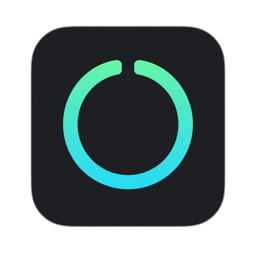
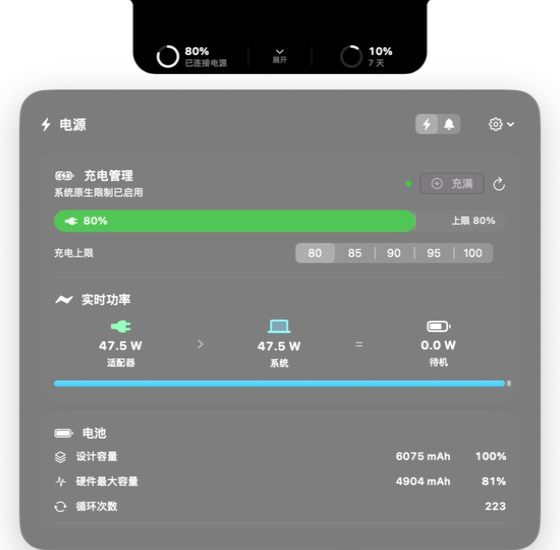

<div align="center">
  
  <h1>Notch Triage</h1>
  <p><strong>把 MacBook 刘海变成真正有用的系统状态与效率中心。</strong></p>
  <p>原生、轻量、常驻的 macOS 刘海工具，集中呈现 Codex 额度、媒体、电源、通知与系统 HUD。</p>

  <p>
    
    
    
    
  </p>

  <p>
    <a href="https://github.com/0Hyacinth0/Notch-Triage/releases/latest"><strong>下载最新版</strong></a>
    ·
    <a href="#核心能力">功能概览</a>
    ·
    <a href="#安装与首次运行">安装指南</a>
    ·
    <a href="https://github.com/0Hyacinth0/Notch-Triage/issues">问题反馈</a>
  </p>
</div>

---

## 产品预览

<p align="center">
  
  <br>
  <sub><strong>默认状态：自定义显示内容在实体刘海两侧保持镜像、紧凑显示</strong></sub>
</p>

<p align="center">
  
  <br>
  <sub><strong>通知、Codex 额度、废纸篓与媒体状态</strong></sub>
</p>

<p align="center">
  
  <br>
  <sub><strong>充电上限、实时功率流、电池健康与适配器遥测</strong></sub>
</p>

<p align="center">
  
  <br>
  
  <br>
  
  <br>
  <sub><strong>音量、亮度与 AirPods 连接状态</strong></sub>
</p>

## 核心能力

| 模块 | 能力 | 说明 |
| --- | --- | --- |
| 刘海交互 | 静止、悬停预览、点击展开 | 窗口锚定屏幕顶边连续变形，左右内容按实体刘海镜像布局 |
| Codex 状态 | ChatGPT / Codex 额度 | 通过本机 Codex App Server 读取账户实际返回的限额桶，不假设固定时间窗口 |
| 系统 HUD | 音量、显示亮度、AirPods | 系统状态变化时以紧凑 HUD 进入刘海，展示完成后自动收起 |
| 媒体中心 | 正在播放与播放进度 | 支持 Apple Music、Spotify、QQ 音乐、网易云音乐等系统媒体来源 |
| 电源管理 | 电池健康、循环次数、实时功率 | 展示适配器、系统与电池之间的功率流；支持系统提供的充电上限档位 |
| 通知与废纸篓 | 通知来源、横幅处理、废纸篓操作 | 通知桥不保存正文；危险操作需要用户明确确认 |
| 稳定性 | 节能调度、休眠感知、诊断面板 | 锁屏、熄屏或休眠时暂停非必要刷新，唤醒后自动恢复 |
| 更新 | GitHub Release 自动更新 | 下载后校验 SHA-256、Bundle ID、版本与签名 Team ID，再原子替换并重启 |

左右翼内容可以分别设置为电池状态、ChatGPT / Codex 额度、正在播放或隐藏，也可以自由互换；配置会跨启动保存。

## 交互方式

1. **静止**：刘海保持紧凑，只呈现必要状态。
2. **悬停**：展开为无回弹的快速预览，精确数值和媒体信息随即出现。
3. **点击**：打开完整 Liquid Glass 面板，集中管理通知、电源、诊断和设置。
4. **离开**：点击桌面或其他 App 后自动收起；面板内菜单和确认弹窗不会误触关闭。

## 安装与首次运行

1. 前往 [Releases](https://github.com/0Hyacinth0/Notch-Triage/releases/latest) 下载最新发布包。
2. 将 `NotchTriage.app` 移入“应用程序”文件夹并启动。

> 如果“应用程序”中同时存在 `NotchTriage.app` 与旧的 `Notch Triage.app`，请先退出两者，再用 v0.1.19 的 `NotchTriage.app` 覆盖并移除旧的空格命名副本，避免同一 Bundle ID 启动两个实例。

3. 根据需要授予辅助功能、Finder 自动化或登录项权限。
4. 点击刘海区域打开面板，在“设置与更新”中配置左右翼内容和通知行为。

> Notch Triage 当前定位为 GitHub / 官网分发的 macOS 工具，不面向 Mac App Store。

### 权限说明

| 权限 | 使用目的 | 是否必需 |
| --- | --- | --- |
| 辅助功能 | 识别系统横幅，并仅在系统提供安全取消动作时尝试收起 | 按需 |
| Finder 自动化 | 读取废纸篓聚合数量、执行经用户确认的清空操作 | 按需 |
| 登录项 | 使用系统 `SMAppService` 实现开机启动 | 可选 |

应用不会安装 root helper。请求辅助功能权限前，面板会先完整收起，再打开系统设置；“修复权限”也只会重置 Notch Triage 自身的授权记录。

## 兼容性

| 项目 | 要求 |
| --- | --- |
| 最低系统 | macOS 26.0 |
| 推荐设备 | 带实体刘海的 MacBook 内建显示器 |
| 原生充电上限 | macOS 27.0 及系统支持的硬件；其他系统自动降级为只读电源监控 |
| Codex 额度 | 本机存在 Codex 或 ChatGPT 提供的 Codex 可执行文件，并已登录对应账户 |
| 完整通知能力 | 需要用户授予辅助功能权限 |

## 隐私与安全

- 通知桥只保存来源 App，不保存通知正文。
- 清除通知、清空废纸篓等操作必须由用户在面板中明确触发。
- 原生横幅仅在系统暴露 `AXCancel` 安全动作时尝试收起，否则保持原样。
- 更新包会校验摘要、Bundle ID、版本与签名身份，不直接执行未经验证的下载内容。
- 后台服务共享节能调度器；面板收起后自动降频，锁屏和休眠期间暂停非必要刷新。

## 诊断与更新

诊断页统一展示媒体、通知、电源、Codex、更新和废纸篓的健康状态、最近检查时间与后台调度状态，并支持复制最近诊断报告。

应用启动时会检查 GitHub 最新 Release，常驻期间每 6 小时复查。临时网络失败会在 15 分钟后重试；更新界面会显示真实下载百分比、已下载大小、总大小以及签名和完整性验证状态。

## 开发构建

### 环境

- Xcode（需包含项目所用的 macOS SDK）
- Swift 5
- macOS 26.0 或更高版本

### 命令行构建

本项目可以使用独立的 Xcode Beta 构建，无需修改全局 `xcode-select`：

```sh
DEVELOPER_DIR=/Applications/Xcode-beta.app/Contents/Developer \
  xcodebuild -project NotchTriage.xcodeproj \
  -scheme NotchTriage \
  -configuration Debug \
  -derivedDataPath /tmp/notch-triage-derived \
  build
```

Debug 构建使用 `com.hyacinth.notchtriage.debug`，正式 Release 使用 `com.hyacinth.notchtriage`，两者的辅助功能授权记录彼此独立。

### 自动化测试

使用 Xcode Beta 运行 macOS 单元测试：

```sh
DEVELOPER_DIR=/Applications/Xcode-beta.app/Contents/Developer \
  xcodebuild test -project NotchTriage.xcodeproj \
  -scheme NotchTriage \
  -destination 'platform=macOS' \
  -derivedDataPath /tmp/notch-triage-tests
```

当前测试覆盖纯模型边界，不覆盖真实系统权限或更新安装流程。

### 分层 App 图标

应用图标由 [Icon Composer 文档](./NotchTriage/AppIcon.icon/icon.json) 构成，三个 SVG 图层随 `.icon` 包一同保存，保留 Default、Dark、Mono 和系统小尺寸渲染能力；圆角遮罩、折射、阴影与材质由系统生成，不预烘焙进源图。

<details>
<summary><strong>展开完整验证清单</strong></summary>

1. 用 Xcode 打开 `NotchTriage.xcodeproj`，选择 `NotchTriage` Scheme。
2. 首次运行时，在“系统设置 → 隐私与安全性 → 辅助功能”中允许调试版 App。
3. 播放 Apple Music、Spotify、QQ 音乐或网易云音乐，检查左翼曲目与进度。
4. 将鼠标移入连续黑色刘海区域检查悬停预览，再点击展开完整面板。
5. 点击桌面或其他 App，确认完整面板自动收起。
6. 检查 Codex 额度是否与 App Server 当前返回的数据一致。
7. 配置“自动收起横幅”，并使用真实通知验证横幅与通知中心行为。
8. 切换 80 / 85 / 90 / 95 / 100% 充电上限，验证系统返回状态；“充满”只应临时覆盖限制。
9. 分别更改左右显示内容，收起并重启 App，确认设置保留。
10. 检查音量、显示亮度与 AirPods 连接 HUD。
11. 在诊断页确认六项服务状态与最近检查时间更新，并测试复制诊断报告。
12. 启用“开机时启动”；如果系统要求批准，检查登录项设置入口。
13. 使用“设置与更新 → 退出 Notch Triage”正常结束应用。

</details>

## 技术边界

- 系统级 Now Playing 使用动态加载的 MediaRemote 桥接，适合官网分发，不适合直接提交 Mac App Store。
- macOS 27 手动充电上限来自系统 PowerUI 接口；旧系统自动降级为只读监控。
- 通知中心没有公开的跨 App 管理 API，辅助功能层级可能随 macOS 更新而变化。
- 当前未加入歌词、窗口切换、自动通知删除或旧系统视觉降级。

## 项目链接

- [Releases](https://github.com/0Hyacinth0/Notch-Triage/releases) — 下载正式版本
- [Issues](https://github.com/0Hyacinth0/Notch-Triage/issues) — 报告问题与提出建议
- [Source](https://github.com/0Hyacinth0/Notch-Triage) — 浏览源代码

---

<p align="center">
  <strong>Notch Triage</strong><br>
  <sub>让原本占据空间的刘海，成为抬眼可见的效率中心。</sub>
</p>
