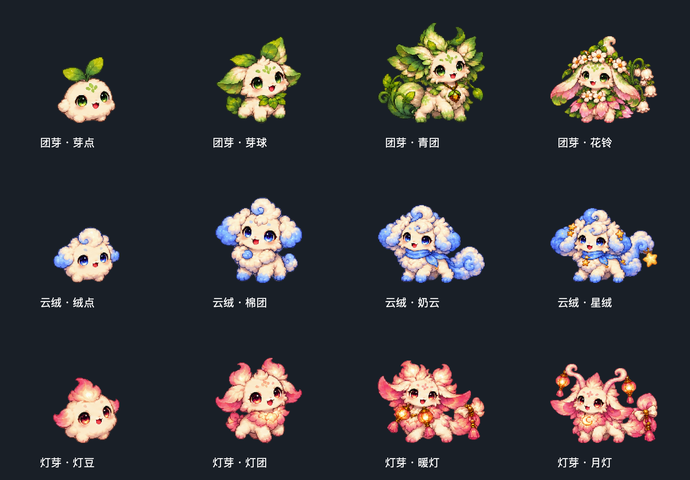
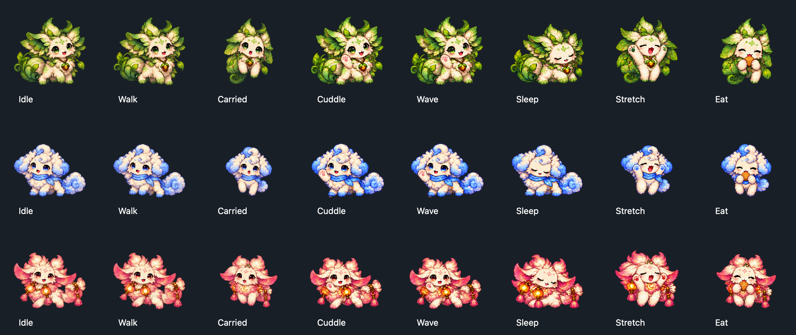

<div align="center">
  
  <h1>Notch Triage</h1>
  <p><strong>把 MacBook 刘海变成真正有用的系统状态与效率中心。</strong></p>
  <p>原生、轻量、常驻的 macOS 刘海工具，集中呈现系统状态，并提供文件暂存与隐私优先的剪贴板历史。</p>

  <p>
    
    
    
    
  </p>

  <p>
    <a href="https://github.com/0Hyacinth0/Notch-Triage/releases/latest"><strong>下载最新版</strong></a>
    ·
    <a href="#核心能力">功能概览</a>
    ·
    <a href="#安装与首次运行">安装指南</a>
    ·
    <a href="https://github.com/0Hyacinth0/Notch-Triage/issues">问题反馈</a>
  </p>
</div>

---

## 核心能力

| 模块 | 能力 | 说明 |
| --- | --- | --- |
| 刘海交互 | 静止、圆环横向速览、悬停预览、点击展开 | 窗口锚定屏幕顶边连续变形，左右内容按实体刘海镜像布局 |
| AI 套餐用量 | 订阅额度、API 余额和消费 | 独立设置页管理平台与账户、连接状态、最后读取时间及刘海显示选择；支持 Codex、Claude Code、DeepSeek、Kimi、OpenRouter、MiniMax、OpenAI/Anthropic 组织消费与 Copilot 个人计费报告 |
| 系统 HUD | 音量、显示亮度、AirPods | 系统状态变化时以紧凑 HUD 进入刘海，展示完成后自动收起 |
| 媒体中心 | 正在播放、播放进度与基础控制 | 支持 Apple Music、Spotify、QQ 音乐、网易云音乐等系统媒体来源；可在面板中播放/暂停、上一首和下一首 |
| 歌词显示 | 刘海下方同步歌词、逐字动画与光效 | 独立设置页；播放器多选、歌词来源与纠错、字体和位置、配色、逐字动画及律动装饰分别设置；支持在线查询与本地导入 |
| 电源管理 | 电池健康、循环次数、实时功率 | 电池圆环可横向速览供电状态、电量与功率；完整面板展示适配器、系统与电池之间的功率流，并支持系统提供的充电上限档位 |
| 通知与废纸篓 | 实时横幅来源、可见通知中心来源、横幅处理、通知清理与废纸篓操作 | 通知桥展示本次运行观察到的横幅来源，以及通知中心打开时可识别的来源和数量，不保留正文；自动收起只处理横幅；清理通过辅助功能操作系统界面并复查“全部清除”控件，系统操作与本地记录分开；Widget Extension 不计入通知；危险操作需要用户明确确认 |
| 文件暂存架 | 拖入、拖出、打开、Finder 定位与会话暂存 | 最多保留 20 个本地文件或文件夹引用；清空只删除引用，不移动、复制或删除原文件 |
| 剪贴板历史 | 文本、图片与本地文件 URL | 默认关闭，用户明确启用后才监控；支持会话、1 天和 7 天保留期限，并可重新复制或随时清空 |
| 稳定性 | 节能调度、休眠感知、诊断面板 | 锁屏、熄屏或休眠时暂停非必要刷新，唤醒后自动恢复 |
| 更新 | 正式版与 Pre-release 测试版通道 | 下载后校验 SHA-256、Bundle ID、版本与签名 Team ID，再原子替换并重启 |

左右翼内容可以分别设置为电池状态、AI 套餐用量、正在播放或隐藏，也可以自由互换；配置会跨启动保存。

在“设置 → AI 套餐用量 → 刘海显示”中，可选择内外双弧、长弧＋底部短弧或左右双弧。默认保留内外双弧；长弧/左弧表示 5 小时剩余额度，底部短弧/右弧表示周剩余额度。选择即时生效并跨启动保存，悬停仍可查看精确数值。

额度消耗时，长弧与底部短弧都从右向左变暗；左右双弧都从上向下变暗。两项额度分别沿自己的固定轨道变化。

## 交互方式

1. **静止**：刘海保持紧凑，只呈现必要状态。
2. **圆环悬停**：媒体圆环横向展开播放控制；电池圆环横向展示供电状态、电量与实时功率。
3. **刘海悬停**：展开为无回弹的快速预览，精确数值和媒体信息随即出现。
4. **点击**：打开完整 Liquid Glass 工作区，在电源、通知、暂存和剪贴板四个分区间切换。
5. **离开**：点击桌面或其他 App 后自动收起；面板内菜单和确认弹窗不会误触关闭。

## 歌词显示

在“设置 → 歌词显示”中打开功能。页面先展示与实际歌词共用渲染组件的实时预览，再依次设置逐字视觉、配色、排版、两侧律动、播放器与歌词来源。长句保持单行并横向滚动；刘海面板展开时，歌词暂时隐藏。

**开始使用：**

1. 在“播放器与账户”保留“自动识别”，或勾选常用播放器。自动识别跟随 macOS 当前播放源；同时打开多个播放器时，也可以用多选限制识别范围。
2. 在“歌词来源”选择自动匹配或按来源顺序。自动匹配先选有真实逐字时间轴的候选，再比较歌曲版本匹配度；找错版本时，可在“同步与纠错”里固定候选、重新匹配或导入歌词。
3. 选择经典流光、弹性流光或流动亮芯，再分别选择从左到右渐进、波浪抬升或程序坞放大动画。视觉效果和高亮动画是两个独立选项。

歌词可查询 Apple Music、酷狗、网易云、QQ、咪咕、酷我、汽水、AMLL、Musixmatch、Deezer、LyricFind 和 LRCLIB 等 12 个在线来源；Apple Music 与酷狗还支持读取客户端留下的本地歌词缓存。每个在线来源都可单独开关。Apple Music 在线歌词需要用户主动连接有效订阅账户，令牌只保存在本机钥匙串；其他来源不使用播放器登录凭证。LyricFind 经 YouTube Music 查询，只接受明确标注为 LyricFind 的歌词。

真实逐字时间取决于歌曲和来源，已接入 QRC、YRC、KRC、咪咕 MRC、酷我 LRCX、增强 LRC 与 TTML 等格式。仅有逐行数据时默认整句显示；“无逐字数据时估算动画”是可选效果，不能保证字与演唱同步。简繁转换使用词组词典，转换显示文字时保留原时间轴。歌词匹配会核对歌名、歌手，以及可获得的专辑和时长；在线接口变更或歌曲版本差异仍可能造成缺词或错配。

播放进度优先使用播放器提供的播放头，系统进度是回退路径。浏览器播放头需要 macOS 自动化授权，并在浏览器中允许通过 Apple 事件执行 JavaScript；应用只检查各窗口的活动标签页。仅指定某个浏览器时，缺少该权限就无法直连。可用“歌词提前量”微调个别歌曲的时间差。

两侧律动可选择柔光频谱、流动波形或水波纹，间距、宽度和高度独立调节。真实频谱使用 Core Audio Tap 分析系统输出音频，需要系统音频权限；音频不保存、不上传，也不使用麦克风。设置预览里的频谱是示意动画。

## 桌面伙伴（Pre-release）

在“设置 → 桌面伙伴”主动开启，领取并孵化第一枚精灵蛋。首批包含团芽、云绒、灯芽三个像素精灵家族，每种有幼体、成长期和两条成年分支。可以喂食、抚摸、休息、洗澡和清理；离线不扣成长、亲密度，也没有死亡惩罚。多只精灵住在小窝，一次放出一只。

精灵会在普通应用上方漫游，拥有走路、挥手、亲近、进食、蜷睡、伸懒腰与整理毛发等动作。单击精灵打开独立的 Liquid Glass 伙伴小屋，可查看状态、照料、切换形态和伙伴；右键保留快捷操作。拖动时精灵会垂下爪子、随移动轻晃，松手时回弹；拖到刘海黑色区域（含两侧翼）时出现柔光提示，松手后向中央入口靠近并钻回小窝，入口光带回应并遮挡精灵。回窝后刘海底部保留爪印入口，点击或按住向下拖即可带它出来；首次回窝会显示操作指引，右键入口也能再次查看。六种照料分别配有爱心、餐碗与食物、点心碎屑、泡泡水纹、清扫星光和睡眠月光／叫醒晨光，设置中可独立预览并调整整体特效强度。设置分为我的伙伴、精灵小窝、小游戏、外观与动效、桌面与数据，支持像素大小、漫游速度、拖选禁入区域、光效和独立音效调节。

角色外观以 imagegen 概念图为参考制作三套透明像素精灵图集，保留毛发、层叠耳形、尾巴和饰品；应用以 128×128 画布显示，并按动作选择待机、拖起、休息、伸展、挥手和进食姿态，每个家族包含幼体、成长期和两个成年分支，共 12 种形态；身体比例、耳形、尾巴和装饰随阶段变化。





成长期解锁贪吃蛇，成年解锁原创飞行射击“星灯航行”。点击“让它玩”开始自主游玩，也可以接管并交还同一局。游戏在桌面右下角约 360 点宽的小区域中进行，上方配有紧凑控制面板；贪吃蛇使用淡网格、渐变蛇身和食物光环，飞行射击使用原创像素飞机、敌机与首领、发光弹体、星点、弹道拖尾、引擎光，以及逐帧命中／爆炸动画。两款游戏分别拥有四项共享训练、八件遗物和独立成就；游戏 HUD 显示两个固定装备槽和六个局内遗物槽，16 款图标可在遗物库与战局中查看；临时遗物最多六种、可升至 R3。全屏、手动操作失焦和回窝按场景暂停，直到失败或主动结束结算；不会自己连续开局。

精灵、蛋、外观与挂起游戏只保存在本机，可导入导出并保留自动备份。玩法演示不产生奖励。当前已通过 Debug 编译，成长节奏、游戏平衡、动画和多屏交互仍需实际体验确认。

## 安装与首次运行

1. 前往 [Releases](https://github.com/0Hyacinth0/Notch-Triage/releases/latest) 下载最新发布包。
2. 将 `NotchTriage.app` 移入“应用程序”文件夹并启动。

> 如果“应用程序”中同时存在 `NotchTriage.app` 与旧的 `Notch Triage.app`，请先退出两者，再用最新版 `NotchTriage.app` 覆盖并移除旧的空格命名副本，避免同一 Bundle ID 启动两个实例。

3. 根据需要授予辅助功能、Finder 自动化、剪贴板访问或登录项权限。
4. 点击刘海区域打开面板；剪贴板历史保持默认关闭，只有点击“启用剪贴板历史”后才开始监控新内容。

> Notch Triage 当前定位为 GitHub / 官网分发的 macOS 工具，不面向 Mac App Store。

### 权限说明

| 权限 | 使用目的 | 是否必需 |
| --- | --- | --- |
| 辅助功能 | 识别系统横幅，并仅在系统提供安全取消动作时尝试收起 | 按需 |
| Finder 自动化 | 读取废纸篓聚合数量、执行经用户确认的清空操作 | 按需 |
| 播放器与浏览器自动化 | 读取指定 Apple Music、Spotify 或浏览器的播放头；浏览器还需自行允许 Apple 事件执行 JavaScript | 使用直连播放头时按需 |
| 系统音频录制 | 分析系统输出音频以驱动歌词两侧真实频谱，不保存音频 | 开启真实频谱时按需 |
| 登录项 | 使用系统 `SMAppService` 实现开机启动 | 可选 |
| 剪贴板访问 | 仅在用户启用 Clipboard History 后读取新复制的白名单内容 | 可选，默认关闭 |

应用不会安装 root helper。请求辅助功能权限前，面板会先完整收起，再打开系统设置；“修复权限”也只会重置 Notch Triage 自身的授权记录。

## 兼容性

| 项目 | 要求 |
| --- | --- |
| 最低系统 | macOS 26.0 |
| 推荐设备 | 带实体刘海的 MacBook 内建显示器 |
| 原生充电上限 | macOS 27.0 及系统支持的硬件；其他系统自动降级为只读电源监控 |
| Codex 额度 | 本机存在 Codex 或 ChatGPT 提供的 Codex 可执行文件，并已登录对应账户 |
| Apple Music 在线歌词 | 用户主动连接有效订阅账户；客户端本地歌词缓存无需连接 |
| 完整通知能力 | 需要用户授予辅助功能权限 |

## 隐私与安全

- 通知桥只保存来源 App，不保存通知正文。
- 清除通知、清空废纸篓等操作必须由用户在面板中明确触发。
- 原生横幅仅在系统暴露 `AXCancel` 安全动作时尝试收起，否则保持原样。
- 更新包会校验摘要、Bundle ID、版本与签名身份，不直接执行未经验证的下载内容。
- Codex 通过本机已登录的 App Server 会话读取；应用不读取其登录令牌。其他平台的 API Key/Token 由用户添加并仅保存在本机钥匙串，余额与凭证不会写入诊断日志。
- Claude Code 状态栏桥接需要用户主动开启：先备份设置，保留已有状态栏输出，只同步额度、会话估算成本和更新时间；通过官方登录状态校验账户，关闭时恢复原配置。
- AI 套餐用量凭证只发送给对应平台接口。账户用量快照仅存内存；Claude 桥接缓存仅写本机应用支持目录。
- 歌词查询会向已启用的第三方歌词来源发送曲目名和歌手；Apple Music 在线令牌仅发送给 Apple，并保存在本机钥匙串。酷狗歌词接口在 HTTPS 不可用时，可对两个限定歌词域名回退到 HTTP，不携带账户凭证。
- 浏览器播放头脚本只读取网页媒体元数据和播放时间，不读取网页正文。Apple Music 在线取词及部分歌词来源依赖可能变化的网页接口，连接状态不等于每首歌曲都可取得歌词。
- 文件暂存架只保存本地 URL 引用；移除或清空暂存架不会操作原文件。
- 剪贴板历史默认关闭，只记录纯文本、PNG/JPEG/TIFF 图片和本地文件 URL；已知 concealed、transient、自动生成及敏感声明会被跳过，但无法保证识别所有第三方密码或令牌。
- 会话模式不落盘；1 天和 7 天模式仅写入本机 Application Support。关闭监控、删除历史或清空历史都不会更改当前系统剪贴板。
- 诊断报告复制、文件复制和“重新复制”使用同一自写回抑制，不会被再次收录为新历史；剪贴板正文不会进入诊断日志或网络请求。
- 后台服务共享节能调度器；面板收起后自动降频，锁屏和休眠期间暂停非必要刷新。


### AI 套餐用量连接

- Codex 自动发现应用包的新旧布局、用户应用目录、PATH 及常见 CLI 安装位置，也支持手动指定路径；使用已登录的官方客户端，不需要复制 OAuth 凭证。
- Claude Code 需要 2.1.251+ 的 Pro/Max 账户；开启状态栏连接后，正常会话响应会同步数据。会话成本是估算值，不代表订阅余额。
- DeepSeek 和 Kimi 查询 API 钱包；Kimi 国内/国际 Key 与币种分别管理，不代表 Kimi Code 订阅。
- OpenRouter Management Key 查询账户余额，普通 API Key 查询该 Key 的预算和消费。
- MiniMax 使用 Token Plan 订阅 Key；仅使用平台明确返回的剩余百分比，其他计数按原字段展示，不猜测剩余额度。
- OpenAI/Anthropic 查询最近 30 天组织消费，需要管理级凭证；不是预付钱包。Copilot 查询个人购买许可的本月计费报告，不推算剩余额度。
- Gemini、GLM、Cursor 等平台尚未完成自动采集验证，当前未提供连接入口。
- 连接多个平台不会自动切换刘海显示账户。读取失败会标记旧数据；完整 Codex 响应和账户变化会清理不再有效的余额。

本地 `docs/`、截图、构建输出、日志及凭证文件不随源码提交或打包发布。

## 诊断与更新

诊断页统一展示媒体、通知、电源、Codex、更新和废纸篓的健康状态、最近检查时间与后台调度状态，并支持复制最近诊断报告。

“设置 → 更新”可选择正式版或测试版。正式版只取 GitHub stable Release；测试版只取标记为 Pre-release 的版本。应用启动及每 6 小时的自动检查遵循当前通道。临时网络失败会在 15 分钟后重试；更新界面会显示真实下载百分比、已下载大小、总大小以及签名和完整性验证状态。

## 开发构建

### 环境

- Xcode（需包含项目所用的 macOS SDK）
- Swift 5
- macOS 26.0 或更高版本

应用版本与 build number 统一维护在 [`Config/Version.xcconfig`](./Config/Version.xcconfig)；Xcode 配置和发布打包脚本都从这里读取。README 顶部的版本徽章跟随 GitHub 最新 Release 自动更新。

### 命令行构建

本项目可以使用独立的 Xcode Beta 构建，无需修改全局 `xcode-select`：

```sh
DEVELOPER_DIR=/Applications/Xcode-beta.app/Contents/Developer \
  xcodebuild -project NotchTriage.xcodeproj \
  -scheme NotchTriage \
  -configuration Debug \
  -derivedDataPath /tmp/notch-triage-derived \
  build
```

Debug 构建使用 `com.hyacinth.notchtriage.debug`，正式 Release 使用 `com.hyacinth.notchtriage`，两者的辅助功能授权记录彼此独立。

### 自动化测试

使用 Xcode Beta 运行 macOS 单元测试：

```sh
DEVELOPER_DIR=/Applications/Xcode-beta.app/Contents/Developer \
  xcodebuild test -project NotchTriage.xcodeproj \
  -scheme NotchTriage \
  -destination 'platform=macOS' \
  -derivedDataPath /tmp/notch-triage-tests
```

当前测试覆盖纯模型边界，不覆盖真实系统权限或更新安装流程。

### 分层 App 图标

应用图标由 [Icon Composer 文档](./NotchTriage/AppIcon.icon/icon.json) 构成，三个 SVG 图层随 `.icon` 包一同保存，保留 Default、Dark、Mono 和系统小尺寸渲染能力；圆角遮罩、折射、阴影与材质由系统生成，不预烘焙进源图。

<details>
<summary><strong>展开完整验证清单</strong></summary>

1. 用 Xcode 打开 `NotchTriage.xcodeproj`，选择 `NotchTriage` Scheme。
2. 首次运行时，在“系统设置 → 隐私与安全性 → 辅助功能”中允许调试版 App。
3. 播放 Apple Music、Spotify、QQ 音乐或网易云音乐，检查左翼曲目与实时推进的进度；在面板中逐一验证播放/暂停、上一首和下一首，并确认无媒体或播放器禁止跳过时按钮自动禁用。
4. 将鼠标移入连续黑色刘海区域检查悬停预览，再点击展开完整面板。
5. 点击桌面或其他 App，确认完整面板自动收起。
6. 在“设置 → AI 套餐用量”添加连接、查看状态并选择刘海显示账户；检查额度、余额/消费、最后读取时间和失败提示。
7. 打开 macOS 通知中心，确认面板只显示可识别的来源计数；默认情况下横幅保持显示，开启“自动收起横幅”后验证新横幅收起而来源记录保留。
8. 在通知中心有内容时执行“清理通知中心”，检查控件复查状态；再单独清除本次横幅记录，确认该操作不影响 macOS 通知中心。
9. 切换 80 / 85 / 90 / 95 / 100% 充电上限，验证系统返回状态；“充满”只应临时覆盖限制。
10. 分别更改左右显示内容，收起并重启 App，确认设置保留。
11. 检查音量、显示亮度与 AirPods 连接 HUD。
12. 在诊断页确认六项服务状态与最近检查时间更新，并测试复制诊断报告。
13. 启用“开机时启动”；如果系统要求批准，检查登录项设置入口。
14. 使用“设置与更新 → 退出 Notch Triage”正常结束应用。
15. 从 Finder 和至少两个第三方 App 拖入/拖出单个与多个文件，确认取消、失败和超限后面板不会卡在拖放状态，且原文件不受影响。
16. 在默认关闭状态确认 Clipboard History 不读取内容；启用后验证文本、图片和文件 URL、系统访问提示、重新复制、自写抑制、锁屏暂停、三种保留期限及“清空历史不清系统剪贴板”。

</details>

## 技术边界

- 系统级 Now Playing 通过随包分发的 BSD 3-Clause `MediaRemoteAdapter` 读取曲目、时长、时间锚点与播放速率，并在界面端推算实时进度；QQ 音乐的 AX 播放器节点只作为元数据与状态兜底。该实现适合官网分发，不适合直接提交 Mac App Store。
- Codex 美元余额是按 OpenAI 当前 `25 credits ≈ US$1` 关系换算的近似值；credits 原值来自本机 App Server，兑换关系变化时可能需要随版本更新。
- macOS 27 手动充电上限来自系统 PowerUI 接口；旧系统自动降级为只读监控。
- 通知中心没有公开的跨 App 通知数据库 API；本程序只通过辅助功能读取可见横幅和已打开通知中心中的可识别来源/数量，并通过其界面发起清理。macOS 的 AX 层级会随系统版本变化；清理后只能复查“全部清除”控件是否还显示，不能保证扫描到每条历史通知或证明系统历史已完全清空。
- 剪贴板敏感类型过滤基于已知声明和保守白名单，不能替代密码管理器自身的安全控制。
- 当前未加入窗口切换、自动清理通知中心历史记录或旧系统视觉降级。

## 项目链接

- [Releases](https://github.com/0Hyacinth0/Notch-Triage/releases) — 下载正式版本
- [Issues](https://github.com/0Hyacinth0/Notch-Triage/issues) — 报告问题与提出建议
- [Source](https://github.com/0Hyacinth0/Notch-Triage) — 浏览源代码

---

### 许可证

Copyright (C) 2026 0Hyacinth0.

除下方明确列出的第三方组件外，本项目自有代码按 [GNU General Public License v3.0](./LICENSE) 授权。GPL-3.0 允许商业使用；分发程序或修改版时，须遵循协议中的对应源代码提供和授权要求。

### 第三方组件许可

- QQ QRC 解码器改编自 [MxIris-LyricsX-Project/LyricsKit](https://github.com/MxIris-LyricsX-Project/LyricsKit)，该文件按 MPL-2.0 提供；原始提交、修改说明与完整许可保存在 `NotchTriage/ThirdParty/LyricsKit/`。
- 简繁词组数据来自 [OpenCC](https://github.com/BYVoid/OpenCC)，按 Apache-2.0 使用，许可文件随资源一同保留。
- `MediaRemoteAdapter` 按 BSD 3-Clause License 提供，许可和 NOTICE 保存在 `Vendor/MediaRemoteAdapter/MediaRemoteAdapter/`。
